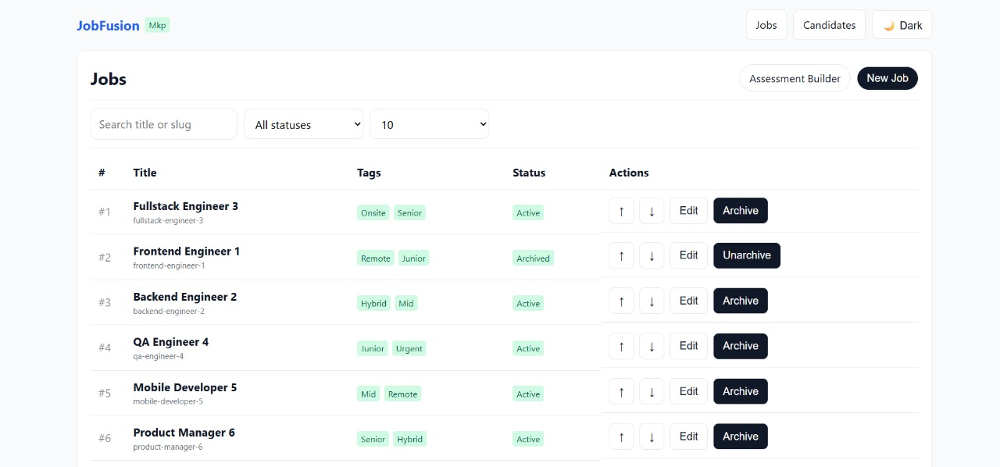
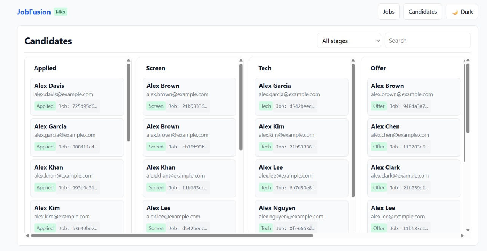

# TALENTFLOW – A MINI HIRING PLATFORM

A mini hiring platform built with React + Vite (JavaScript), using Dexie (IndexedDB) for storage and MSW to simulate a backend with realistic latency and write failures. Features include Jobs management, a Candidates Kanban with drag-and-drop, a virtualized Candidates table, and an Assessment Builder.



## 1. Setup
Prerequisites
- Node.js 18+ and npm
- Modern browser (Chrome/Edge/Firefox)

## Features 📌

- Natural language query processing
- Job description analysis
- Semantic search using embeddings
- API for programmatic access
- Web interface for easy interaction
- Evaluation metrics (Mean Recall@3 and MAP@3)

## Project Structure 📂

\`\`\`
src/
├─ app/            # main.jsx, router.jsx, queryClient, useDocumentTitle
├─ api/            # msw.js + domain handlers
├─ db/             # dexie schema, seeding, data generators
├─ features/
│  ├─ jobs/
│  ├─ candidates/  # Kanban.jsx, CandidatesVirtualTable.jsx, page
│  └─ assessments/
├─ components/     # Spinner, ErrorBanner, Pagination
├─ styles/         # globals.css (+ optional tokens.css)
└─ utils/          # sleep.js (latency & failure), rand.js/randish.js

\`\`\`

## Technical Approach

### Data Model (Dexie)

jobs: {
  id, title, slug, status, order, tags[], createdAt
}

candidates: {
  id, name, email, jobId, stage, location, skills[], years, salary, createdAt, updatedAt
}

timelines: {
  id, candId, jobId, stage, note, at
}

assessments: {
  jobId, schema: { title, questions[] }
}

### Data Flow

- UI triggers React Query call → MSW handler (HTTP-like)

- Handler waits 200–1200ms and may throw 5–10% errors for writes

- Handler performs Dexie reads/writes

- UI shows loading / success / error states

- State Management

- React Query caches server shapes and mutations

- Local UI state is minimal (filters, dialogs, form values)




### Technical Decisions

1. Client-only stack (Dexie + MSW) → fast iteration + realistic flows
2. React Query → consistent loading/error handling, easy retries
3. dnd-kit → Kanban drag-and-drop
4. Virtualized list → scales to 1k+ candidates smoothly
5. BulkPut for seeding → avoids duplicate-key errors
6. Responsive CSS → mobile Kanban uses horizontal swipe, desktop fits 6 columns
7. Write-failure injection → only on mutations to simulate realistic errors

### Known Issues & Workarounds

1. Chrome extension noise: Use Incognito / disable extensions
2. MSW worker MIME error: Run npx msw init public --save & restart dev server
3. Not seeing seeded data: Clear IndexedDB + seed flag or bump flag in seed.js
4. Kanban column overflow: Use flex layout or scrollable columns

## Styling & UX Guidelines

1. Optional tokens.css for colors, spacing, shadows
2. Tables collapse to card rows on mobile
3. Filter bars wrap on mobile
4. Kanban: .kanban, .kanban-col, .kanban-tile for styling
5. Accessibility: :focus-visible, aria-label/role, contrast ≥ 4.5:1

##  Performance Notes
- Virtualization prevents DOM bloat
- React Query: set staleTime to reduce refetch, limit retry
- Use SVGs for icons, avoid large assets

## Troubleshooting
- Module export errors: Check import names, restart Vite
- Service worker stuck: DevTools → Application → Service Workers → Unregister
- Seeding loops: Wrap in try/catch, mark flag in finally, bulkPut, retry after clearing IndexedDB

## Future Enhancements
- Real backend + auth
- Server-side pagination & filtering
- Richer Assessment Builder (preview, validation, scoring)
- Export/import demo data (CSV/JSON)
- Tests (unit, component, E2E)
- CI: lint/test/build on push

\`\`\`
Use MSW or MirageJS to simulate a REST API with the following resources:
• GET /jobs?search=&status=&page=&pageSize=&sort=
• POST /jobs → { id, title, slug, status: "active"|"archived", tags: string[], order: number }
• PATCH /jobs/:id
• PATCH /jobs/:id/reorder → { fromOrder, toOrder } (occasionally return 500 to test
rollback)
• GET /candidates?search=&stage=&page=
• POST /candidates → { id, name, email, stage:
"applied"|"screen"|"tech"|"offer"|"hired"|"rejected" }
• PATCH /candidates/:id (stage transitions)
• GET /candidates/:id/timeline
• GET /assessments/:jobId
• PUT /assessments/:jobId
• POST /assessments/:jobId/submit (store response locally)
\`\`\`

## Getting Started

### Prerequisites

- Node.js 18+
- npm or yarn

### Installation

1. Clone the repository
 ```sh
   git clone https://github.com/maneeshmkp/talentFlow-Entnt
   cd talentFlow
   ```

2. ### Install dependencies:
  ```sh
   npm install
    ```

3. ### Run the development server:
   ``` sh
   npm run dev
   ```

4. ### Running Sever
Open [http://localhost:3000](http://localhost:3000) in your browser

## Deployment

The application can be deployed to Vercel with a single command:

\`\`\`
vercel
\`\`\`

## Quick Start Checklist
npm install
npx msw init public --save
# Verify ensureSeeded() → 25 jobs / 1,000 candidates / ≥3 assessments
# If counts changed → clear IndexedDB + seed flag
npm run dev


## Connect with Me 🚀

[](https://x.com/ManeeshKum14044)
[](https://github.com/maneeshmkp)
[](https://www.linkedin.com/in/maneeshmkp/)


## License 📜  

This project is licensed under the **MIT License** – see the [LICENSE](LICENSE) file for details.  

---

## Keep Learning and Exploring 🚀  

Happy coding! 😊 If you find this project helpful, give it a ⭐ on GitHub!  